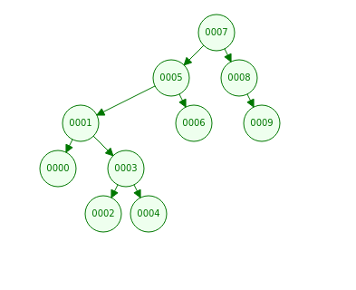

## [7, 5, 1, 8, 3, 6, 0, 9, 4, 2] dizisinin Binary-Search-Tree aşamalarını yazınız.

- Root 7
- 5<7 => sol node'a yazılır
- 1<7 1<5 => 5'in sol node'u olur
- 8>7 => sağ node olur
- 3<7 3<5 3>1 => 1'in sağına yazılır
- .
- .
- .
  
